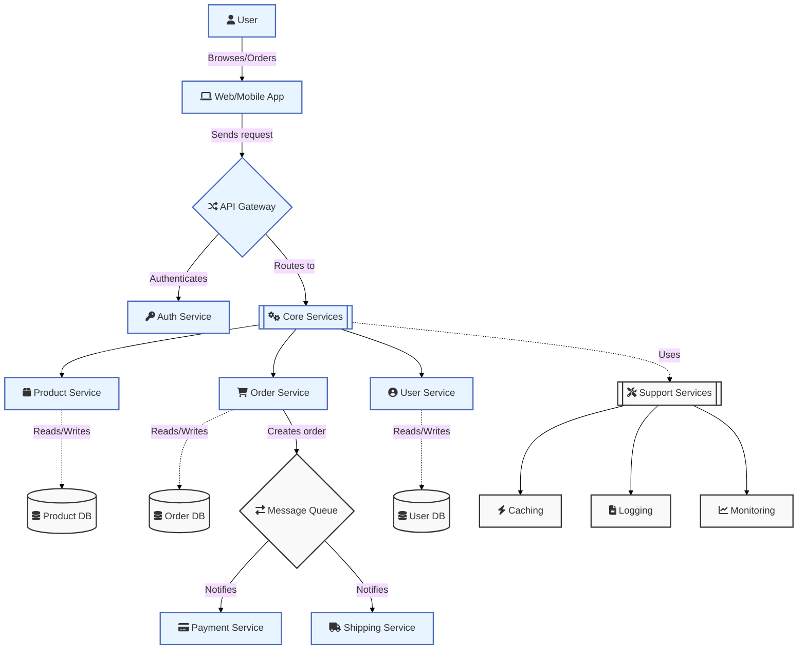

# E-commerce Microservices Architecture

## Service Descriptions

### 1. User Interaction
- **Web/Mobile App**: Frontend applications that users interact with to browse products and place orders.

### 2. API Gateway
- **API Gateway**: Routes incoming requests to appropriate microservices, handles authentication, and manages API versioning.
- **Auth Service**: Manages user authentication and authorization, generating and validating JWT tokens.

### 3. Core Services
- **Product Service**: Manages product catalog, including product information, pricing, and availability.
- **Order Service**: Handles order creation, processing, and management.
- **User Service**: Manages user profiles, preferences, and account information.

### 4. Data Storage
- Each core service has its own dedicated database to ensure data isolation and service independence.

### 5. Order Processing
- **Message Queue**: Facilitates asynchronous communication between services, ensuring reliable order processing.
- **Payment Service**: Handles payment processing and verification.
- **Shipping Service**: Manages order fulfillment and shipping logistics.

### 6. Support Services
- **Caching**: Improves performance by caching frequently accessed data.
- **Logging**: Centralizes log collection for monitoring and troubleshooting.
- **Monitoring**: Tracks system health, performance metrics, and alerts on issues.

## Technology Stack

- **Frontend**: React.js, React Native
- **API Gateway**: Spring Cloud Gateway
- **Authentication**: Spring Security, JWT
- **Microservices Framework**: Spring Boot
- **Database**: PostgreSQL (relational), MongoDB (non-relational)
- **Message Queue**: Apache Kafka
- **Caching**: Redis
- **Service Discovery**: Netflix Eureka
- **Containerization**: Docker
- **Orchestration**: Kubernetes
- **Logging**: ELK Stack (Elasticsearch, Logstash, Kibana)
- **Monitoring**: Prometheus, Grafana
- **CI/CD**: Jenkins, GitLab CI

This architecture enables a scalable, maintainable, and robust e-commerce platform. Each microservice is independently deployable and scalable, allowing for efficient resource utilization and easier maintenance.
